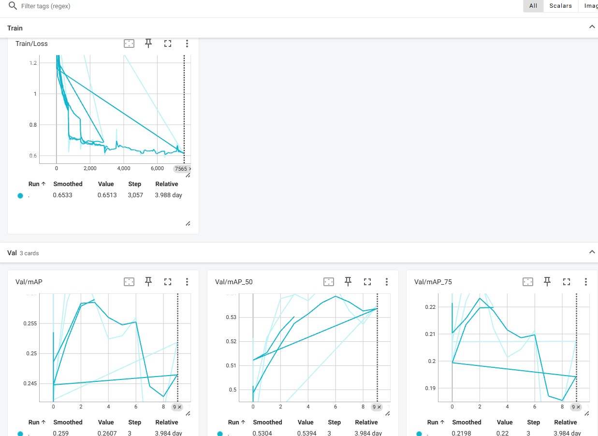

 <h1 align="center">FasterRCNN-VOC</h1>

## Introduction

Faster R-CNN (Region-based Convolutional Neural Network) is a state-of-the-art object detection framework widely used in computer vision tasks. 
It builds on earlier versions of R-CNN (Regions with Convolutional Neural Networks) and significantly improves speed and accuracy. 
Faster R-CNN is commonly applied in applications like image recognition, autonomous vehicles, medical imaging, and more.

## Inference

   
  <i>Demo</i>

## Dataset
I used VOC Dataset to train my model. If you don't have VOC dataset, open script VOCdataset and run with download = True, It will download automaticly

## Classes:
'background', 'aeroplane', 'bicycle', 'bird', 'boat', 'bottle', 'bus', 'car', 'cat', 'chair',
'cow', 'diningtable', 'dog', 'horse', 'motorbike', 'person', 'pottedplant', 'sheep', 'sofa',
'train', 'tvmonitor'

## Training

To train the model, download the VOC Dataset files 
After setting this up, you can start training by running the command:
python trainRCNN.py

## Experiments:

 

## Requirements

* **python**
* **cv2**
* **pytorch** 
* **numpy**
